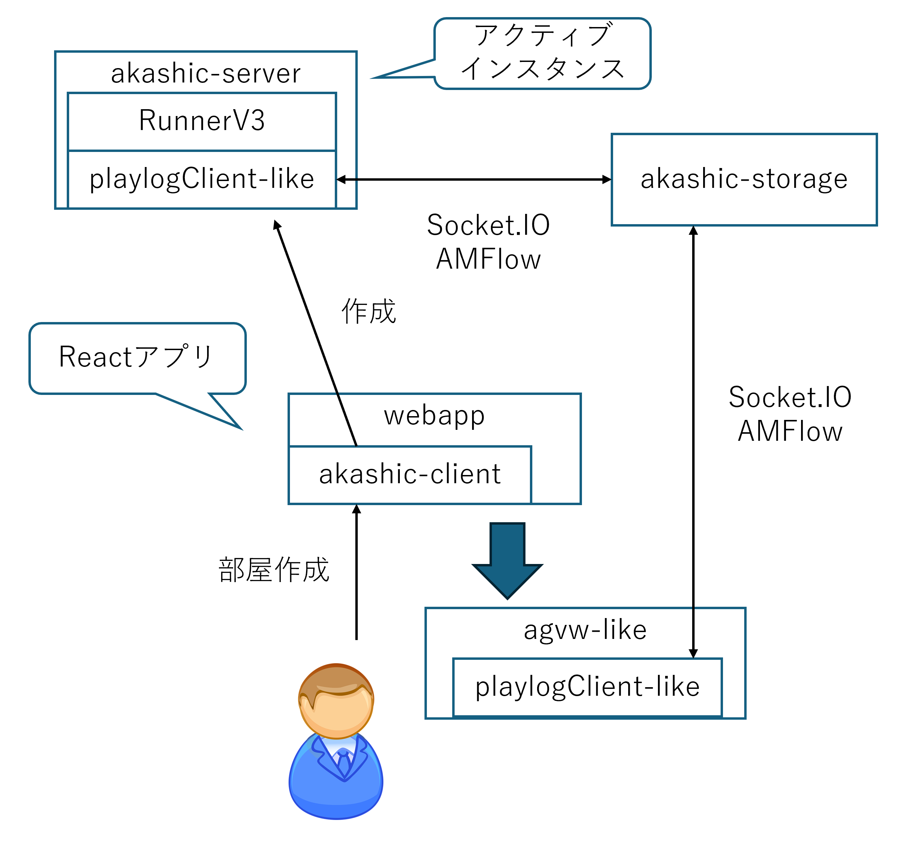

# Akashic Platform

> [!CAUTION]
> このプロジェクトは実装中です。まだ動かないよ

[dwango](https://dwango.co.jp/) 提供の [Akashic Engine](https://akashic-games.github.io/) のマルチプレイモードに準拠したゲームをプレイ可能にする Web サービス実装です。

- 用語
  - ゲーム: ユーザーが投稿したもの
  - プレイ: ゲームを起動したもの

- メイン機能
  - ゲーム投稿
  - プレイ開始
  - プレイ参加

- 機能要件
  - ユーザー登録
  - ゲーム一覧
  - プレイ一覧
  - ユーザー名取得プラグインの代替実装

## 構成図

本プラットフォームは以下の3つのプロセスから構成されます。

- akashic-server
  実行中の各プレイの実処理を進める。
- akashic-storage
  実行中の全プレイ情報を保管する。
- webapp
  各種操作できるWebアプリケーション



## リポジトリ構成

### webapp

ゲームプラットフォームとして機能する Web アプリケーション 実装

### schema

クライアント・サーバー両者で必要なスキーマ定義置き場

### agvw-like

ビューアーの基盤モジュールです。[`@akashic/agvw`](https://github.com/akashic-games/agvw) を元に制作しています。

### playlogClient-like

[`@akashic/agvw`](https://github.com/akashic-games/agvw) が使用している `playlogClient` モジュールの実装です。当該モジュールのソースが公開されていないため、独自に実装しています。

### akashic-server

プレイごとにアクティブインスタンスを起動するサーバー。
`akashic serve` がクライアントと密結合なため独自に実装します。

### akashic-storage

プレイ時の実行時情報の保存と配信機能。
`akashic serve` のメモリ効率が悪いため独自に実装します。

## インストール方法・使い方

### インストール

```sh
npm install
```

### セットアップ

> [!NOTE]
>
> TODO
>
> - 環境設定定義を一箇所にまとめる
> - セットアップスクリプトの定義
> - 一括起動スクリプトの定義

#### akashic-storage, akashic-server

`.env.local.example` の記述を参考に `.env.local` を配置してください。

#### webapp

```sh
npx -w ./webapp auth secret
```

`.env.local.example` の記述を参考に `.env.local` にパラメタを追記してください。

### 実行方法

> [!NOTE]
>
> 下記3つは現状、すべてフォアグラウンドで実行されます

```sh
npm run run -w ./akashic-storage
npm run run -w ./akashic-server
npm run dev -w ./webapp
```

設定変更は `./akashic-storage`, `./akashic-server`, `./webapp` 配下に `.env` を置くことでできます。 `.env.example` を参考にしてください。

`./webapp/public/content/[id]` にゲームデータ（`game.zip`を解凍したもの）を配置すると当該ゲームで遊ぶことができます。

`http://localhost:3000` にアクセスするとゲームで遊ぶことができます。

## LICENSE

- [MIT License](./LICENSE)

> [!IMPORTANT]
>
> [`./agvw-like`](./agvw-like/) は DWANGO Co., Ltd. が [MIT License](https://github.com/akashic-games/agvw/blob/main/LICENSE) で公開している [`@akashic/agvw`](https://github.com/akashic-games/agvw) をリバースエンジニアリングにして作成したものです。
> 詳細は [`./agvw-like/README.md`](./agvw-like/README.md) を参照してください。

## Author

- yasshi2525 ([X](https://x.com/yasshi2525))
